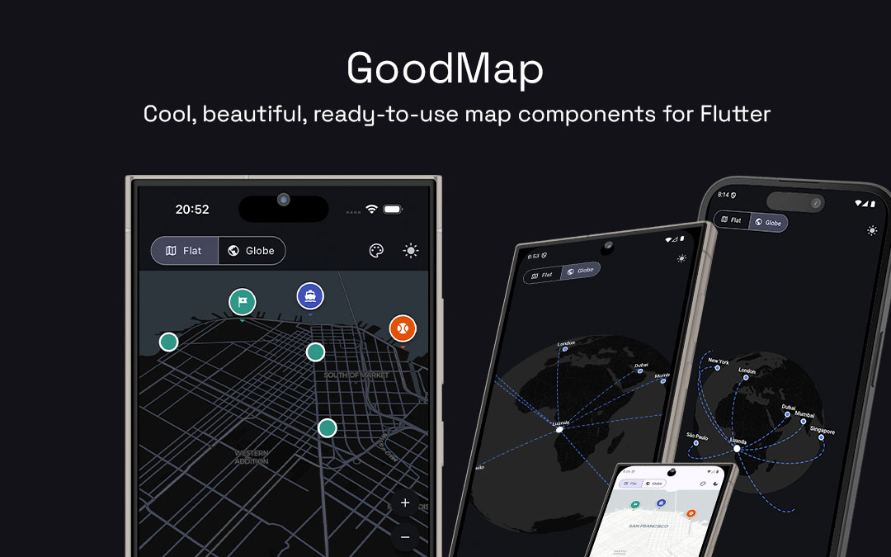
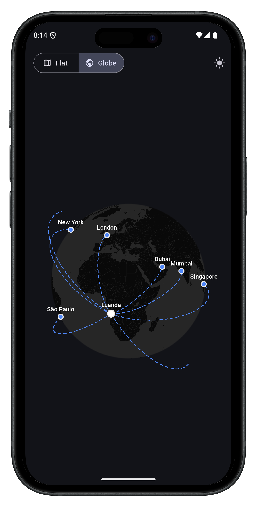
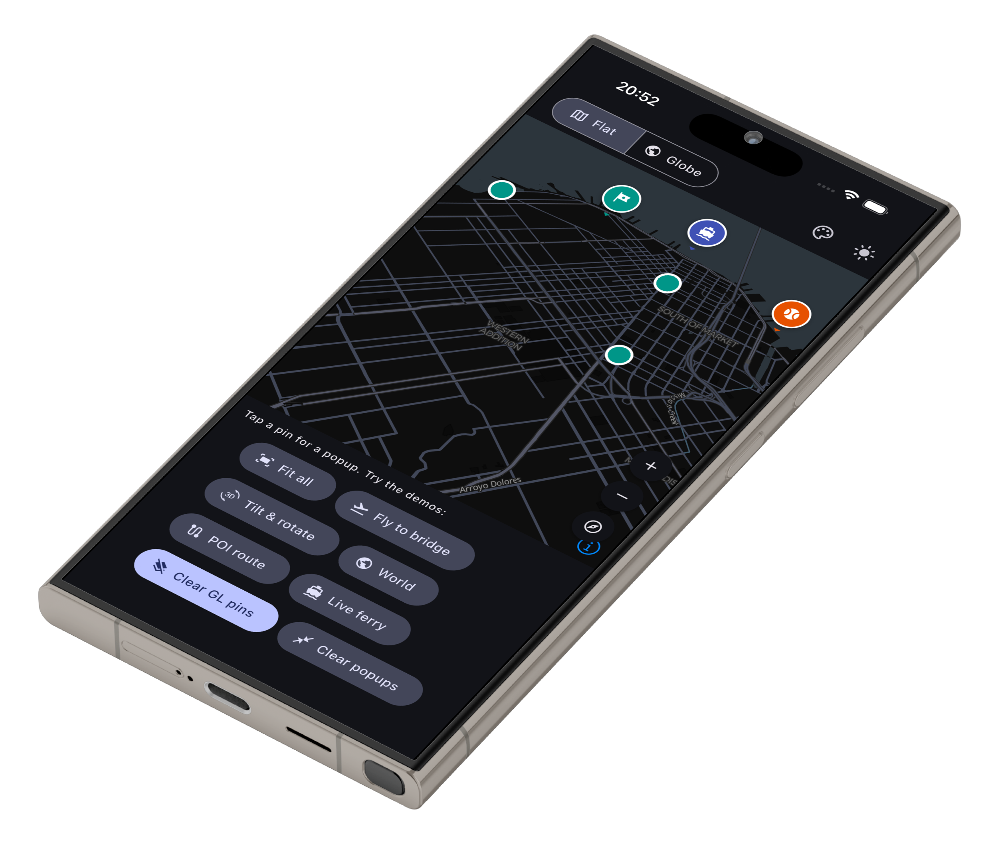

# goodmap



Cool, beautiful, ready-to-use map components for Flutter — inspired by
[mapcn](https://mapcn.dev). Two drop-in surfaces: a themed **flat map** built on
native MapLibre, and a **3D globe** with points, labels and animated
great-circle arcs.

- **Theme-aware** — follows your app's light/dark `Theme` (CARTO basemaps).
-  **Ready to use** — small, predictable, controller-based API.
- **Native globe** — a real spinning globe with **no `flutter_gpu`**, rendered
  in a single `ui.FragmentProgram` (works on iOS, Android, web, desktop).

## Install

```yaml
dependencies:
  goodmap: ^0.2.0
```

```dart
import 'package:goodmap/goodmap.dart';
```

The flat map uses `maplibre_gl`, which requires **iOS 13+** and Android
**`minSdkVersion 21`**.

## Globe (`GoodGlobe`)



A minimalist, theme-aware globe with inertial drag-rotate, pinch-zoom, points +
labels, and animated dashed arcs — back-of-globe overlays hide automatically.

```dart
GoodGlobe(
  initialCenter: const LatLng(-8.84, 13.23), // Luanda
  initialZoom: 1.0,
  atmosphere: false,
  markers: const [
    MarkerOptions(position: LatLng(-8.84, 13.23), label: 'Luanda', color: Colors.white, radius: 6),
    MarkerOptions(position: LatLng(51.50, -0.13), label: 'London'),
  ],
  arcs: const [
    GlobeArc(from: LatLng(-8.84, 13.23), to: LatLng(51.50, -0.13)),
  ],
  onTap: (latLng) { /* tap → coordinate */ },
)
```

- **`GoodGlobe`** — `markers`, `arcs`, `atmosphere`, `onTap`, `onPointTap`.
- **`MarkerOptions`** — `position`, `label`, `color`, `radius`.
- **`GlobeArc`** — `from`, `to`, `color`, `width`, `dashed`, `bend`, `segments`.

### Globe that zooms into streets (`GoodMapGlobe`)

Use `GoodMapGlobe` instead of `GoodGlobe` for a globe that **cross-fades to the
native flat map** (full vector streets/cities) once you pinch past a zoom
threshold, and back out to the globe — same API plus `markers`/`arcs`/`atmosphere`.

```dart
GoodMapGlobe(
  initialCenter: const LatLng(-8.84, 13.23),
  markers: [...],
  arcs: [...],
)
```

## Flat map (`GoodMap`)



A themed slippy map with overlay markers/popups, polylines and zoom/compass
controls, driven by a `GoodMapController`.

```dart
GoodMap(
  initialCenter: const LatLng(37.77, -122.42),
  initialZoom: 11,
  controls: const GoodControls(zoom: true, compass: true),
  onMapReady: (c) {
    c.addMarker(MarkerOptions(
      position: const LatLng(37.77, -122.42),
      child: const Icon(Icons.location_on),
      onTap: () => c.showPopup(
        const LatLng(37.77, -122.42),
        const Card(child: Padding(padding: EdgeInsets.all(12), child: Text('SF'))),
      ),
    ));
  },
)
```

`GoodMapController`:
- **Camera:** `flyTo`, `animateTo`, `fitBounds`, `moveTo`
- **Markers:** `addMarker`, `updateMarker`, `removeMarker`, `clearMarkers`
- **Popups:** `showPopup`, `hidePopup`, `clearPopups`
- **Polylines:** `addPolyline`, `removePolyline`, `clearPolylines`
- **Dotted Grid:** `enableDottedGrid`, `disableDottedGrid`
- **Heatmaps:** `addHeatmap`, `updateHeatmap`, `removeHeatmap`, `clearHeatmaps`

Both surfaces follow `Theme.of(context).brightness` (CARTO positron / dark-matter).

## Dotted World Map ("pointed map")

You can draw a stylized dotted landmass grid on both the 3D globe and the flat map:

```dart
// On the Globe or Hybrid surface (declarative):
GoodGlobe(
  initialCenter: const LatLng(0, 0),
  showDottedGrid: true,
  dottedGridColor: Colors.grey.withOpacity(0.3),
  dottedGridRadius: 1.2,
)
```

## Heatmaps

Plot geographic density heatmaps on both surfaces:

```dart
// On the Globe surface (declarative):
GoodGlobe(
  initialCenter: const LatLng(0, 0),
  heatmaps: [
    HeatmapOptions(
      points: const [LatLng(37.77, -122.42), LatLng(37.80, -122.45)],
      weights: const [1.0, 0.5], // Optional relative weights (0.0 to 1.0)
      radius: 20.0,        // Radius of influence in pixels
    ),
  ],
)

// On the Flat Map (via controller):
final heatmapId = await controller.addHeatmap(
  HeatmapOptions(
    points: const [LatLng(37.77, -122.42), LatLng(37.80, -122.45)],
    weights: const [1.0, 0.5],
    radius: 30.0,
  ),
);
await controller.removeHeatmap(heatmapId);
```

## Basemap terms

goodmap uses CARTO's public basemap tiles. Review CARTO's and OpenStreetMap's
terms before production use, and supply your own style/tiles if required.

## License

MIT
